# worker-verifier-pipeline

**Work that ships with its checksum.** A runnable demo of a gated agent pipeline:
one agent drafts, a different (cheaper) agent verifies, and only output that survives
the gate ever reaches a human. The doctrine behind it lives in
[agent-verification-rails](https://github.com/ChecksumStudio/agent-verification-rails);
this repo is the doctrine running.



> **Status: portfolio exhibit.** This repo demonstrates how I build gated pipelines
> for clients — it is complete, the committed receipts are from real runs, and it is
> not seeking issues, PRs, or feature requests. Want one built for your process?
> That's [the gig](https://www.fiverr.com/checksum_studio).

## The thesis, in four moves

1. **Fluency is the constant; grounding is the variable.** A hallucinated claim and a
   verified one are written in the same confident voice. You cannot read your way to
   the difference — "does this sound right" is exactly the check that fails.
2. **So stop trying to detect the failure mode.** Make every output pass a gate that
   cites rules and evidence, regardless of how good it looks.
3. **That converts discovery into lookup.** "Is this competence or confident invention?"
   is expensive and paid by you. "Does it violate rule R2?" is cheap and delegable to
   the cheapest model in the fleet.
4. **The babysitting tax never goes to zero — it gets delegated.** From your attention
   to a gate re-running checks at cents per run. That is the product.

## What it does

The demo task is cold outreach email — chosen because everyone can judge the output —
but the shape is the point, and the shape transfers to any process:

```
brief ──> WORKER (sonnet) ──> draft
                                │
                    deterministic checks          ← free: length, banned words,
                                │                   placeholders, subject, sign-off
                    LLM VERIFIER (haiku)          ← cheap, and a DIFFERENT model:
                                │                   judgment rules only (R4, R7)
              ┌─────────────────┴──────────────┐
            HELD                            FAILED
              │                                │
        outbox/ + receipt        violations → back to worker (max 3 attempts)
                                               │
                                 3 strikes → NOTHING ships.
                                 The empty outbox is the honest result.
```

Every step writes a line to `receipts/<run_id>.jsonl` with the draft's sha256, the
stage, the model, the verdict, and every violation with its rule ID.

## Design choices that are the actual product

- **No verdict says "approved."** The gate returns `HELD` — *"I could not break this
  with the checks I ran"* — or `FAILED`. HELD is not "good", and the verdict lists
  what it did **not** examine (`not_checked`), so a pass can't be quietly carried
  into territory the gate never looked at.
- **Cheapest check rejects first.** Deterministic checks (zero cost) run before any
  model is asked to judge. A draft with a `[Name]` placeholder in it never spends a
  token on an LLM verifier.
- **The verifier is a different, cheaper model than the worker.** A model re-reading
  its own output brings its own blind spots to the audit. Judging "does this violate
  R7" does not need the expensive model — matching the check's *shape* matters more
  than the checker's size.
- **Fail closed.** If the verifier returns malformed output, the draft fails. An
  unreadable verdict is not a soft yes.
- **Abstention is a result.** Three failed attempts means nothing ships and the
  receipts say why. A pipeline that always produces output is a pipeline that
  sometimes delivers garbage confidently.
- **Rules carry IDs; rejections cite them.** "Sounds off" is not a verdict. Every
  rejection is `rule → evidence`, which is what makes the retry loop converge
  instead of thrash.

## A real run (receipts committed, unedited)

The gate rejecting the deliberately bad fixture — 10 violations, zero LLM cost:

```
[deterministic-checks] verdict: FAILED
  R5 — clickbait subject opener: 'quick question'
  R2 — banned word: 'revolutionize'   (and 5 more)
  R3 — 4 exclamation marks (max 1)
  R6 — placeholder survived: '[Name]'
  R8 — sender name 'Riley' not in the closing lines
```

A full run shipping on attempt 1 — same draft hash at every stage, both tiers HELD:

```
[worker-draft]          model: sonnet  sha256: ce96fa8bfbb5e99c
[deterministic-checks]  verdict: HELD  sha256: ce96fa8bfbb5e99c
[llm-verifier]          model: haiku   verdict: HELD  sha256: ce96fa8bfbb5e99c
[shipped]               outbox/20260813_191546_attempt1.md
```

Full logs in [`receipts/`](receipts/), shipped output in [`outbox/`](outbox/).

## Run it yourself

Zero dependencies if you have [Claude Code](https://claude.com/claude-code)
(uses your subscription, no API key):

```bash
python3 run_pipeline.py briefs/acme_intro.md
```

Or with the Anthropic SDK: `pip install anthropic`, set `ANTHROPIC_API_KEY`, same
command — the provider is picked automatically.

Watch the gate reject the bad fixture without spending a token:

```bash
python3 run_pipeline.py briefs/acme_intro.md --verify-only fixtures/bad_draft.md
```

Write your own brief (copy `briefs/acme_intro.md`; the `Sender:` line is required)
and your own rules (`rules/outreach_style.md` — keep the rule IDs).

## Honest limits

- **HELD is not proof.** The gate catches the failure classes it was shaped for —
  rule violations and invented facts — not "this email will get replies."
- **The LLM verifier can itself be wrong.** It is cheap and shape-matched, not
  infallible; the deterministic tier exists because counting is more reliable
  than judgment.
- **A gate an agent knows about becomes a target.** For what that means and what to
  do about it, read
  [agent-verification-rails](https://github.com/ChecksumStudio/agent-verification-rails) —
  this demo is the entry point, not the whole discipline.

## License

MIT — see [LICENSE](LICENSE).
